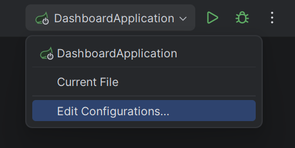
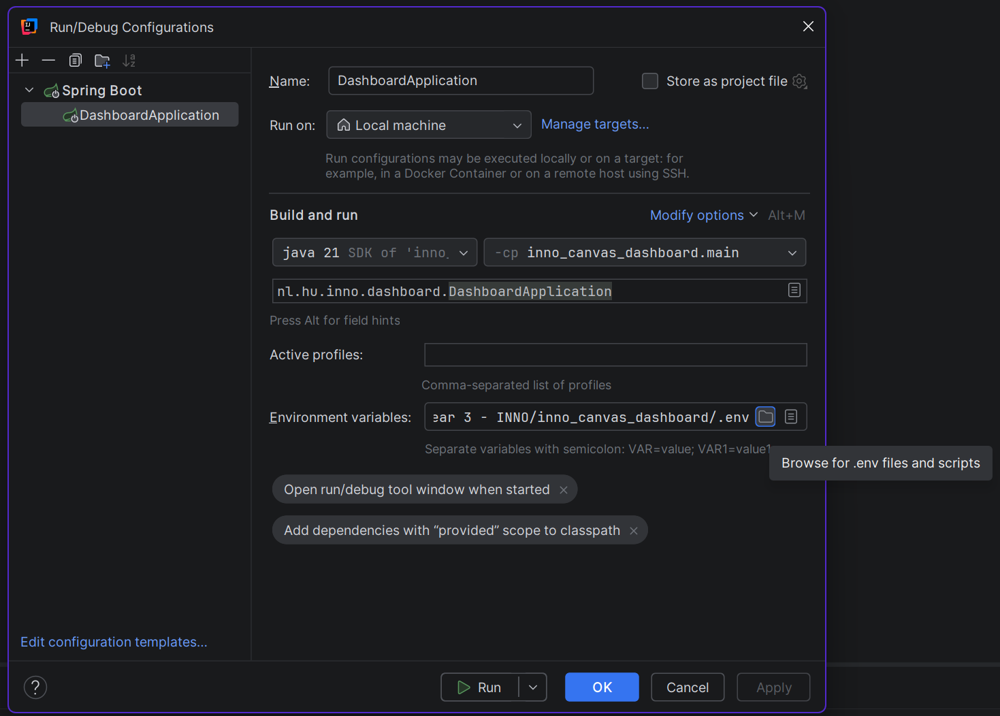

# inno_canvas_dashboard

## Technische Specificaties

**Programmeertalen:**
- Kotlin (Java 21+)
- Python
- JavaScript

**Frameworks:**
- Spring Boot (3.5.6)
- React

**Belangrijke backend dependencies/libraries:**
- Spring Data JPA
- Spring Security
- Spring Web
- Apache Commons Csv
- Apache Commons IO
- PostgreSQL Driver
- JUnit5
- ArchUnit
- OAuth2

**Overige tools:**
- Docker
- PostgreSQL 16+
- PgAdmin4

---

## Benodigdheden

- Nieuwste versie van de applicatie
- Git installatie
- Java 21+ installatie
- Npm installatie
- Docker Desktop installatie
- PostgreSQL 16+ installatie
- Database management software (zoals PgAdmin4)
- Backend IDE: IntelliJ IDEA (aanbevolen voor Kotlin)
- Frontend IDE: naar keuze (bijvoorbeeld Visual Studio Code)

---

## .env Bestanden

Voor het lokaal draaien van de applicatie zijn twee `.env` bestanden nodig:

**Frontend .env**  
Maak in `/frontend/canvas_dashboard/` een bestand `.env` met:

```
VITE_LOGOUT_URL=http://localhost:8080/logout
VITE_AUTH_URL=http://localhost:8080/oauth2/authorization/azure
```

**Backend .env**  
Maak in de project root een bestand `.env` met:

```
SPRING_PROFILES_ACTIVE=dev
AZURE_TENANT_ID=x
AZURE_CLIENT_ID=x
AZURE_CLIENT_SECRET=x
DB_USERNAME=inno-dashboard
DB_PASSWORD=inno-dashboard
DB_NAME=inno-dashboard
```
Waarbij de "x"s vervangen moeten worden door waarden vermeld in het overdrachtsdocument.

---

## Opzetten Lokale Ontwikkelomgeving

1. Zorg dat alle benodigdheden geïnstalleerd zijn.
2. Verkrijg de broncode:
   - Clone de repository van GitHub, of
   - Download als ZIP-bestand en pak uit.
3. Open de projectfolder in je IDE en maak de `.env` bestanden aan zoals hierboven beschreven.
4. **Backend .env koppelen in IntelliJ IDEA:**
   - Ga naar "Edit Configurations" bij de runner.
   - 
   - Voeg de backend environment variables toe door het mapje te selecteren en de `.env` in de project root te kiezen.
   - 
5. Start de Postgres container:
   ```
   docker-compose up -d
   ```
6. Controleer in Docker Desktop of de containers draaien.
7. Start de backend (Spring Boot) door `DashboardApplication` te runnen. De database wordt automatisch voorzien van het JPA-schema.
8. Start de frontend:
   ```
   cd frontend/canvas_dashboard
   npm i && npm run dev
   ```
9. De webapp is nu bereikbaar* op [http://localhost:5173](http://localhost:5173). *dit adres kan verschillen afhankelijk van de npm configuratie of poortbezetting, controlleer dan de terminal output.

---

## REST API Endpoints

### Kotlin Backend
De volgende endpoints zijn allemaal beveiligd met Spring Security door middel van Oauth2.

| Component      | Methode | URI                                      | Opties                |
|----------------|---------|------------------------------------------|-----------------------|
| dashboard      | GET     | `/api/v1/dashboard/users`                |                       |
| dashboard      | GET     | `/api/v1/dashboard/users/admin`          |                       |
| dashboard      | PUT     | `/api/v1/dashboard/users/admin`          |                       |
| dashboard      | GET     | `/api/v1/dashboard/[instanceName]`       | Cursus instance naam  |
| dashboard      | POST    | `/api/v1/dashboard/users/refresh`        |                       |
| pythongateway  | POST    | `/api/v1/scripts/[environment]`          | ENV_TWO, ENV_THREE    |

### Python Environments
De Python environments zijn niet inbegrepen in deze repository, maar zijn voor het gemak gebundeld omdat de Kotlin backend deze (in productie) wel aanroept.

| Environment | Methode | URI        |
|-------------|---------|------------|
| Env 2       | POST    | `/run-env2`|
| Env 3       | POST    | `/run-env3`|

---
