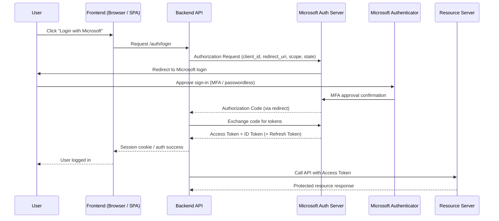

```mermaid
sequenceDiagram
    participant U as User
    participant F as Frontend (Browser / SPA)
    participant B as Backend API
    participant M as Microsoft Auth Server
    participant A as Microsoft Authenticator
    participant R as Resource Server

    U->>F: Click "Login with Microsoft"
    F->>B: Request /auth/login
    B->>M: Authorization Request (client_id, redirect_uri, scope, state)
    M->>U: Redirect to Microsoft login
    U->>A: Approve sign-in (MFA / passwordless)
    A->>M: MFA approval confirmation
    M-->>B: Authorization Code (via redirect)
    B->>M: Exchange code for tokens
    M-->>B: Access Token + ID Token (+ Refresh Token)
    B-->>F: Session cookie / auth success
    F-->>U: User logged in
    B->>R: Call API with Access Token
    R-->>B: Protected resource response

```