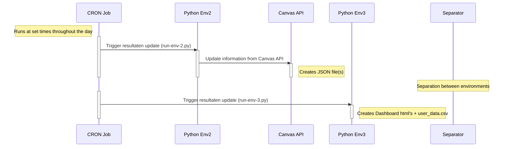

```mermaid
sequenceDiagram
    participant CRON as CRON Job
    participant Env2 as Python Env2
    participant Canvas as Canvas API
    participant Env3 as Python Env3

    Note left of CRON: Runs at set times throughout the day

    activate CRON
    CRON->>Env2: Trigger resultaten update (run-env-2.py)
    activate Env2
    Env2->>Canvas: Update information from Canvas API
    activate Canvas
    Note right of Canvas: Creates JSON file(s)
    deactivate Canvas
    deactivate Env2
    deactivate CRON

    Note over Separator: Separation between environments

    activate CRON
    CRON->>Env3: Trigger resultaten update (run-env-3.py)
    activate Env3
    Note right of Env3: Creates Dashboard html's + user_data.csv
    deactivate Env3
    deactivate CRON
```