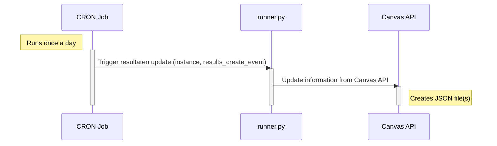

```mermaid
sequenceDiagram
    participant CRON as CRON Job
    participant Runner as runner.py
    participant Canvas as Canvas API

    Note left of CRON: Runs once a day

    activate CRON
    CRON->>Runner: Trigger resultaten update (instance, results_create_event)
    activate Runner
    Runner->>Canvas: Update information from Canvas API
    activate Canvas
    Note right of Canvas: Creates JSON file(s)
    deactivate Canvas
    deactivate Runner
    deactivate CRON
```